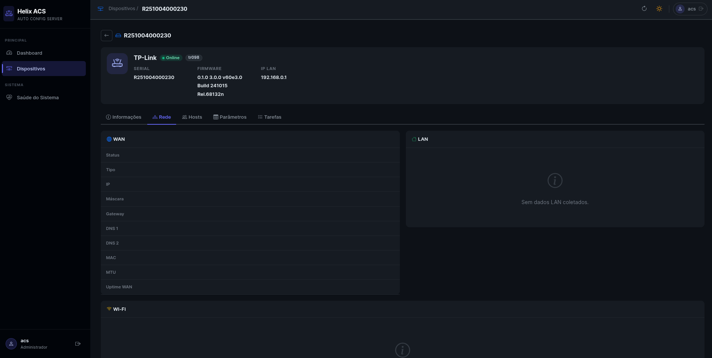
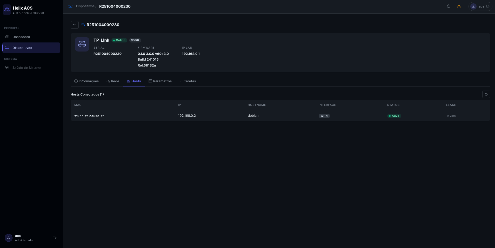
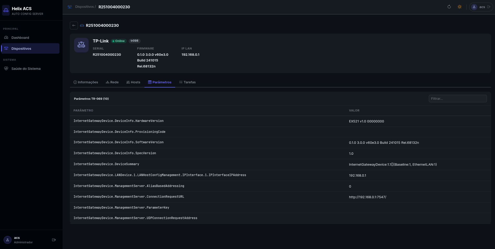
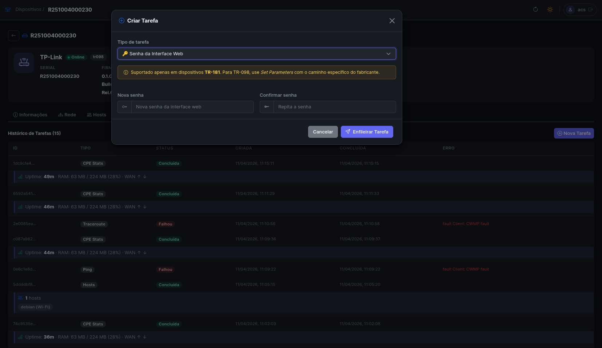

# Helix ACS

[](https://pkg.go.dev/github.com/raykavin/helix-acs)
[](https://golang.org/dl/)
[](https://goreportcard.com/report/github.com/raykavin/helix-acs)
[](LICENSE.md)

### Auto Configuration Server (ACS) for CPE Management


Servidor de configuração automática (ACS) para gerenciamento de equipamentos CPE via protocolo TR-069 (CWMP). Permite provisionar, monitorar e executar tarefas remotas em roteadores e modems de qualquer fabricante que implemente os modelos de dados TR-181 ou TR-098.

## Sumário

- [Visão geral](#visão-geral)
- [Funcionalidades](#funcionalidades)
- [Arquitetura](#arquitetura)
- [Pré-requisitos](#pré-requisitos)
- [Configuração](#configuração)
- [Execução](#execução)
- [Interface web](#interface-web)
- [API REST](#api-rest)
- [Tarefas CWMP](#tarefas-cwmp)
- [Modelos de dados](#modelos-de-dados)
- [Esquemas de parâmetros](#esquemas-de-parâmetros)
- [Desenvolvimento](#desenvolvimento)

---

## Imagens

**Login**


**Dashboard**


**Dispositivos**


**Detalhes do dispositivo**









**Criação de tarefas**




**Saúde do sistema**


---

## Visão geral

O Helix ACS funciona como o lado servidor do protocolo TR-069. Quando um roteador ou modem (CPE) é ligado, ele contata o ACS via HTTP/SOAP. O servidor então registra o dispositivo, aplica configurações pendentes e coleta estatísticas, tudo de forma transparente para o usuário final.

Dois servidores HTTP rodam simultaneamente:

- **Servidor CWMP** na porta `7547`: recebe conexões das CPEs (autenticação Digest)
- **Servidor de API e interface web** na porta `8080`: utilizado pelos administradores (autenticação JWT)

## Funcionalidades

**Gerenciamento de dispositivos**
- Registro automático de CPEs no primeiro contato (Inform)
- Descoberta dinâmica de números de instância TR-181 e TR-098
- Detecção automática do modelo de dados (TR-181 ou TR-098)
- Resolução automática de esquema por fabricante (ex: Huawei, ZTE) com fallback para o esquema genérico
- Filtro e paginação na listagem de dispositivos
- Edição de tags e metadados

**Tarefas remotas**
- Configuração de Wi-Fi (SSID, senha, canal, banda 2,4 GHz e 5 GHz)
- Configuração WAN (PPPoE, DHCP, IP fixo, VLAN, MTU)
- Configuração LAN e servidor DHCP
- Alteração da senha da interface web do dispositivo
- Atualização de firmware via URL
- Redirecionamento de portas (adicionar, remover, listar)
- Reinicialização e reset de fábrica
- Set/Get de parâmetros TR-069 arbitrários

**Diagnósticos**
- Ping test com resultado detalhado (RTT mínimo, médio, máximo e perda de pacotes)
- Traceroute com listagem de saltos
- Speed test (download)
- Listagem de dispositivos conectados (hosts DHCP)
- Estatísticas de CPE (uptime, RAM, contadores WAN)

**Interface web**
- Painel com resumo de dispositivos e estado do sistema

## Arquitetura

```
CPE (roteador/modem)
      |
      | HTTP/SOAP (TR-069 / CWMP)
      |
      v
+---------------------+        +----------+
|  Servidor CWMP      |        |          |
|  porta 7547         +------->+ MongoDB  |
|                     |        | (devices)|
|  Digest Auth        |        +----------+
+---------------------+
                               +----------+
+---------------------+        |          |
|  API REST + Web UI  +------->+  Redis   |
|  porta 8080         |        | (tasks)  |
|                     |        +----------+
|  JWT Auth           |
+---------------------+
      ^
      |
  Administrador (navegador / API client)
```

**Pacotes principais:**

| Pacote | Responsabilidade |
|---|---|
| `cmd/api` | Ponto de entrada, composição de dependências e inicialização dos servidores |
| `internal/cwmp` | Protocolo CWMP: parsing de SOAP, sessão Inform, execução de tarefas |
| `internal/api` | Roteamento HTTP, handlers REST, middlewares (CORS, JWT, rate limit, logging) |
| `internal/device` | Modelo de dispositivo, repositório MongoDB e serviço |
| `internal/task` | Tipos de tarefa, payloads, fila Redis e executor |
| `internal/datamodel` | Interface `Mapper`, mappers TR-181 e TR-098 com descoberta dinâmica de instâncias |
| `internal/schema` | Carregamento de esquemas YAML, resolução por fabricante e `SchemaMapper` |
| `internal/auth` | JWT e Digest Auth |
| `internal/config` | Carregamento e validação de configuração (Viper) |
| `web` | Interface web incorporada ao binário (HTML, CSS, JS) |

## Pré-requisitos

- Go 1.25 ou superior
- MongoDB 7
- Redis 7
- Docker e Docker Compose (opcional, para execução em contêiner)

## Configuração

Copie o arquivo de exemplo e ajuste os valores:

```bash
cp configs/config.example.yml configs/config.yml
```

Os campos obrigatórios que devem ser alterados antes da primeira execução são:

| Campo | Descrição |
|---|---|
| `application.jwt.secret` | Segredo para assinatura dos tokens JWT. Use `openssl rand -base64 32` para gerar um valor seguro. |
| `application.acs.password` | Senha que as CPEs usam para autenticar no ACS. |
| `application.acs.url` | URL pública do ACS provisionada nas CPEs (deve ser acessível pela rede das CPEs). |
| `databases.cache.uri` | URI de conexão com o Redis. |
| `databases.storage.uri` | URI de conexão com o MongoDB. |

Consulte o arquivo [configs/config.example.yml](configs/config.example.yml) para a descrição completa de cada campo.

### Referência de configuração

**`application`**

| Campo | Tipo | Descrição |
|---|---|---|
| `name` | string | Nome exibido no banner de inicialização |
| `log_level` | string | Nível de log: `debug`, `info`, `warn`, `error` |
| `jwt.secret` | string | Chave secreta para tokens JWT |
| `jwt.expires_in` | duration | Validade do access token (ex: `24h`) |
| `jwt.refresh_expires_in` | duration | Validade do refresh token (ex: `168h`) |

**`application.acs`**

| Campo | Tipo | Descrição |
|---|---|---|
| `listen_port` | int | Porta do servidor CWMP (padrão TR-069: `7547`) |
| `username` | string | Usuário para autenticação Digest das CPEs |
| `password` | string | Senha para autenticação Digest das CPEs |
| `url` | string | URL do ACS provisionada nas CPEs |
| `inform_interval` | int | Intervalo de Inform em minutos |
| `schemas_dir` | string | Caminho para o diretório de esquemas YAML (padrão: `./schemas`) |

**`application.web`**

| Campo | Tipo | Descrição |
|---|---|---|
| `listen_port` | int | Porta da API e interface web (padrão: `8080`) |
| `use_ssl` | bool | Habilita TLS direto na aplicação |
| `crt` | string | Caminho para o certificado PEM |
| `key` | string | Caminho para a chave privada PEM |

**`application.tasks.queue`**

| Campo | Tipo | Descrição |
|---|---|---|
| `max_attempts` | int | Tentativas máximas antes de marcar a tarefa como `failed` |
| `interval` | duration | Intervalo de varredura da fila |

**`databases.storage`** (MongoDB)

| Campo | Tipo | Descrição |
|---|---|---|
| `uri` | string | URI de conexão (ex: `mongodb://localhost:27017`) |
| `name` | string | Nome do banco de dados |
| `log_level` | string | Nível de log do driver |

**`databases.cache`** (Redis)

| Campo | Tipo | Descrição |
|---|---|---|
| `uri` | string | URI de conexão (ex: `redis://localhost:6379`) |
| `ttl` | duration | TTL das tarefas na fila (ex: `168h`) |

## Execução

### Local (binário)

```bash
# Instalar dependências e compilar
go build -o helix ./cmd/api

# Iniciar com o arquivo de configuração padrão
./helix

# Iniciar com caminho de configuração personalizado
./helix -config /etc/helix/config.yml
```

### Docker Compose

A forma mais simples de subir todo o ambiente:

```bash
# Configurar antes de iniciar
cp configs/config.example.yml configs/config.yml
# edite configs/config.yml com suas credenciais

# Subir os serviços (MongoDB, Redis e aplicação)
docker compose up -d

# Acompanhar os logs
docker compose logs -f app

# Parar
docker compose down
```

O `docker-compose.yml` expõe as portas `7547` (CWMP) e `8080` (API/UI) no host. Os dados do MongoDB e Redis são persistidos em volumes nomeados.

### Docker (imagem isolada)

```bash
# Build da imagem
docker build -t helix-acs .

# Executar com arquivo de configuração montado
docker run -d \
  -p 7547:7547 \
  -p 8080:8080 \
  -v $(pwd)/configs:/helix/configs \
  --name helix-acs \
  helix-acs
```

## Interface web

Acesse `http://localhost:8080` no navegador. As credenciais de acesso são as mesmas definidas em `application.acs.username` e `application.acs.password` no arquivo de configuração.

**Paginas disponíveis:**

| Pagina | Descrição |
|---|---|
| Dashboard | Contador de dispositivos (total, online, offline), tarefas recentes |
| Dispositivos | Listagem com filtros, detalhes de cada CPE, parâmetros TR-069 e histórico de tarefas |
| Saúde do sistema | Estado de conectividade com MongoDB e Redis |

Na tela de detalhes de um dispositivo é possível criar tarefas, editar tags e visualizar todos os parâmetros retornados pela CPE no último Inform.

## API REST

Todas as rotas protegidas requerem o cabeçalho `Authorization: Bearer <token>`.

### Autenticação

| Método | Rota | Descrição |
|---|---|---|
| POST | `/api/v1/auth/login` | Autentica e retorna access token e refresh token |
| POST | `/api/v1/auth/refresh` | Renova o access token com um refresh token válido |

**Login:**
```json
POST /api/v1/auth/login
{
  "username": "acs",
  "password": "sua_senha"
}
```

Resposta:
```json
{
  "token": "eyJ...",
  "refresh_token": "eyJ...",
  "expires_in": 86400
}
```

### Dispositivos

| Método | Rota | Descrição |
|---|---|---|
| GET | `/api/v1/devices` | Lista dispositivos (paginado, com filtros) |
| GET | `/api/v1/devices/{serial}` | Retorna um dispositivo pelo número de série |
| PUT | `/api/v1/devices/{serial}` | Atualiza metadados (tags, alias) |
| DELETE | `/api/v1/devices/{serial}` | Remove um dispositivo |
| GET | `/api/v1/devices/{serial}/parameters` | Retorna todos os parâmetros TR-069 da CPE |

**Filtros disponíveis em `GET /api/v1/devices`:**

| Parâmetro | Tipo | Descrição |
|---|---|---|
| `page` | int | Página (padrão: 1) |
| `limit` | int | Itens por página (padrão: 20) |
| `manufacturer` | string | Filtrar por fabricante |
| `model` | string | Filtrar por modelo |
| `online` | bool | Filtrar por estado online/offline |
| `tag` | string | Filtrar por tag |
| `wan_ip` | string | Filtrar por IP WAN |

### Tarefas

| Método | Rota | Descrição |
|---|---|---|
| GET | `/api/v1/devices/{serial}/tasks` | Lista tarefas de um dispositivo |
| POST | `/api/v1/devices/{serial}/tasks/{tipo}` | Cria uma nova tarefa |
| GET | `/api/v1/tasks/{task_id}` | Retorna uma tarefa pelo ID |
| DELETE | `/api/v1/tasks/{task_id}` | Cancela uma tarefa pendente |

### Saúde

| Método | Rota | Descrição |
|---|---|---|
| GET | `/health` | Estado do sistema (sem autenticação) |

## Tarefas CWMP

As tarefas são enfileiradas no Redis e entregues à CPE na próxima sessão Inform. Cada tarefa tem no máximo `max_attempts` tentativas de execução.

**Estados possíveis:** `pending`, `executing`, `done`, `failed`, `cancelled`

### Tipos de tarefa

**Configuração**

| Tipo | Rota | Payload principal |
|---|---|---|
| Wi-Fi | `POST .../tasks/wifi` | `band`, `ssid`, `password`, `channel`, `enabled` |
| WAN | `POST .../tasks/wan` | `connection_type` (pppoe/dhcp/static), `username`, `password`, `ip_address`, `vlan`, `mtu` |
| LAN / DHCP | `POST .../tasks/lan` | `dhcp_enabled`, `ip_address`, `subnet_mask`, `dhcp_start`, `dhcp_end` |
| Senha web | `POST .../tasks/web-admin` | `password` |
| Set Parameters | `POST .../tasks/parameters` | `parameters` (mapa de caminho TR-069 para valor) |
| Firmware | `POST .../tasks/firmware` | `url`, `version`, `file_type` |
| Port forwarding | `POST .../tasks/port-forwarding` | `action` (add/remove/list), `protocol`, `external_port`, `internal_ip`, `internal_port` |

**Manutenção**

| Tipo | Rota | Payload |
|---|---|---|
| Reiniciar | `POST .../tasks/reboot` | nenhum |
| Reset de fábrica | `POST .../tasks/factory-reset` | nenhum |

**Diagnóstico**

| Tipo | Rota | Payload principal |
|---|---|---|
| Ping | `POST .../tasks/ping` | `host`, `count`, `packet_size`, `timeout` |
| Traceroute | `POST .../tasks/traceroute` | `host`, `max_hops`, `timeout` |
| Speed test | `POST .../tasks/speed-test` | `download_url` |
| Dispositivos conectados | `POST .../tasks/connected-devices` | nenhum |
| Estatísticas CPE | `POST .../tasks/cpe-stats` | nenhum |

**Exemplo: configurar Wi-Fi**

```bash
curl -X POST http://localhost:8080/api/v1/devices/AABBCC123456/tasks/wifi \
  -H "Authorization: Bearer eyJ..." \
  -H "Content-Type: application/json" \
  -d '{
    "band": "2.4",
    "ssid": "MinhaRede",
    "password": "senha12345",
    "enabled": true
  }'
```

**Exemplo: ping test**

```bash
curl -X POST http://localhost:8080/api/v1/devices/AABBCC123456/tasks/ping \
  -H "Authorization: Bearer eyJ..." \
  -H "Content-Type: application/json" \
  -d '{
    "host": "8.8.8.8",
    "count": 4
  }'
```

## Modelos de dados

O Helix ACS suporta os dois modelos de dados TR-069 mais usados no mercado.

**TR-181** (prefixo `Device.`): modelo moderno, adotado em equipamentos fabricados a partir de 2010. Suportado pela maioria dos roteadores atuais.

**TR-098** (prefixo `InternetGatewayDevice.`): modelo legado, comum em equipamentos mais antigos e em parte do parque instalado no Brasil.

O modelo é detectado automaticamente no primeiro Inform, com base no objeto raiz informado pela CPE.

### Descoberta dinâmica de instâncias

CPEs diferentes podem atribuir números de instância distintos às interfaces. Por exemplo, o WAN pode estar em `Device.IP.Interface.1` ou `Device.IP.Interface.3`, dependendo do fabricante.

A cada Inform, o sistema executa `DiscoverInstances` que varre os parâmetros recebidos e identifica os índices reais de:

- Interface WAN e LAN (por classificação de IP público/privado)
- Interface PPP
- Rádios Wi-Fi, SSIDs e Access Points (por `OperatingFrequencyBand`, com fallback por ordem de índice)
- Dispositivos WAN e conexões TR-098

Dessa forma as tarefas são sempre enviadas para o caminho correto, independentemente do fabricante.

### Senha da interface web

Para dispositivos TR-181, o caminho padrão é `Device.Users.User.1.Password`. Fabricantes como Huawei usam caminhos proprietários (ex: `Device.X_HW_Security.AdminPassword`) — esses casos são cobertos por esquemas vendor-específicos em `schemas/vendors/`. Para dispositivos TR-098 sem esquema vendor cadastrado, use a tarefa `set_parameters` informando o caminho diretamente.

## Esquemas de parâmetros

Todos os caminhos de parâmetros TR-069 são definidos em arquivos YAML no diretório `schemas/`. Nenhum caminho está embutido no código da aplicação.

### Estrutura do diretório

```
schemas/
├── tr181/                        # Caminhos padrão TR-181
│   ├── wifi.yaml
│   ├── wan.yaml
│   ├── lan.yaml
│   ├── system.yaml
│   ├── management.yaml
│   ├── diagnostics.yaml
│   ├── hosts.yaml
│   ├── port_forwarding.yaml
│   └── change_password.yaml
├── tr098/                        # Caminhos padrão TR-098
│   └── ...                       # mesma estrutura
└── vendors/
    ├── huawei/
    │   └── tr181/
    │       └── change_password.yaml   # sobrescreve apenas o que difere
    └── zte/
        └── tr098/
            └── change_password.yaml
```

### Formato de um arquivo de esquema

```yaml
id: change_password
model: tr181
vendor: huawei
description: Senha de administrador para dispositivos Huawei TR-181

parameters:
  - name: admin.password
    path: "Device.X_HW_Security.AdminPassword"
    type: string
```

### Resolução de esquema por fabricante

A cada Inform o sistema identifica o fabricante reportado pela CPE e resolve o esquema a ser usado:

1. Normaliza o nome do fabricante para um slug (ex: `"Huawei Technologies Co., Ltd."` → `"huawei"`)
2. Verifica se existe `vendors/<slug>/<modelo>/` no diretório de esquemas
3. Se existir, carrega o esquema genérico do modelo como base e **sobrepõe** apenas os parâmetros definidos no esquema vendor-específico
4. Se não existir, usa somente o esquema genérico (`tr181` ou `tr098`)

O nome do esquema resolvido (ex: `"vendor/huawei/tr181"` ou `"tr181"`) é persistido no documento do dispositivo no MongoDB.

### Adicionando suporte a um novo fabricante

Crie um arquivo YAML apenas com os parâmetros que diferem do padrão:

```bash
mkdir -p schemas/vendors/meuFabricante/tr181
cat > schemas/vendors/meufabricante/tr181/change_password.yaml << 'EOF'
id: change_password
model: tr181
vendor: meufabricante
description: Senha de administrador

parameters:
  - name: admin.password
    path: "Device.X_VENDOR_AdminPassword"
    type: string
EOF
```

Reinicie a aplicação. Nenhuma alteração de código é necessária.

## Desenvolvimento

### Executar testes

```bash
go test ./...
```

### Build local

```bash
go build -o helix ./cmd/api
```

### Build da imagem Docker

```bash
docker build -t helix-acs .
```

O Dockerfile usa multi-stage build: compila em `golang:1.25-alpine` e gera uma imagem final mínima baseada em `alpine:3.22`, rodando com usuário sem privilégios de root.

### Estrutura de diretórios

```
.
+-- cmd/api/           Ponto de entrada da aplicação
+-- configs/           Arquivos de configuração
+-- schemas/           Esquemas YAML de parâmetros TR-069
|   +-- tr181/         Caminhos padrão TR-181
|   +-- tr098/         Caminhos padrão TR-098
|   +-- vendors/       Sobreposições por fabricante
+-- internal/
|   +-- api/           Roteamento e handlers REST
|   +-- auth/          JWT e Digest Auth
|   +-- config/        Estruturas e carregamento de configuração
|   +-- cwmp/          Servidor e handler CWMP (TR-069 / SOAP)
|   +-- datamodel/     Interface Mapper, TR-181 e TR-098, descoberta de instâncias
|   +-- device/        Modelo, repositório MongoDB e serviço de dispositivos
|   +-- logger/        Wrapper do logger
|   +-- schema/        Registry, Resolver e SchemaMapper orientados a YAML
|   +-- task/          Tipos de tarefa, fila Redis e executor
+-- web/               Interface web (HTML, CSS, JS) incorporada ao binário
+-- examples/          Simulador de CPE para testes locais
+-- docker-compose.yml Ambiente completo com MongoDB e Redis
+-- Dockerfile         Build e imagem de produção
```

## Contribuindo

Contribuições para o helix-acs são bem-vindas! Aqui estão algumas maneiras de você ajudar a melhorar o projeto:

- **Reporte erros e sugestão de recursos** abrindo issues no GitHub
- **Envie pull requests** com correções de erros ou novos recursos
- **Aprimore a documentação** para ajudar outros usuários e desenvolvedores
- **Compartilhe suas estratégias personalizadas** com a comunidade

---

## Licença
O helix-acs é distribuído sob a **Licença MIT**.</br>
Para os termos e condições completos da licença, consulte o arquivo [LICENSE](LICENSE) no repositório.

---

## Contato

Para suporte, colaboração ou dúvidas sobre helix-acs:

**E-mail**: [raykavin.meireles@gmail.com](mailto:raykavin.meireles@gmail.com)</br>
**LinkedIn**: [@raykavin.dev](https://www.linkedin.com/in/raykavin-dev)</br>
**GitHub**: [@raykavin](https://github.com/raykavin)